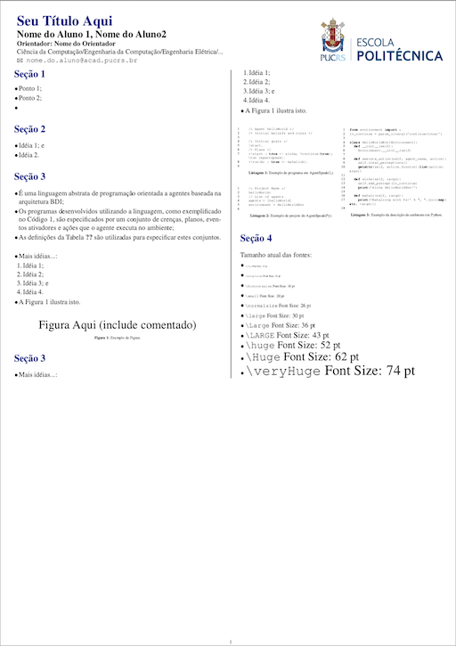

# Modelo de Poster para TC



Modelo de poster para TCs da Escola Politécnica, baseado no modelo de pôsteres da finada [FACIN](https://github.com/meneguzzi/facin-tc-poster-template).


## Como usar

1. Abra o arquivo ```poster.tex```
2. Adicione seu conteúdo nas seções correspondentes
3. Por organização, colocar figuras na pasta ```./fig```
4. Compile o poster com o comando:
```bash
pdflatex poster.tex && pdflatex poster.tex && pdflatex poster.tex
```

## Documentos Base

- Este modelo foi construído sobre a classe [a0poster](http://tug.ctan.org/tex-archive/macros/latex/contrib/a0poster/)
- [Mini tutorial das opções de a0poster](http://www.eng.auburn.edu/~reevesj/Classes/ELEC6970-latex/posters/BEAMERPOSTER.pdf), além de outras opções de formatação de pôsteres com outras classes

## Exemplos de pôsteres de meus alunos

- [Andre dos Santos](https://github.com/meneguzzi/meneguzzi-final-projects/blob/master/posters/AndreLeonhardt_poster.pdf)
- [Gabriel e Bruno](https://github.com/meneguzzi/meneguzzi-final-projects/blob/master/posters/GabrielBruno_poster.pdf)
- [Martin e William](https://github.com/meneguzzi/meneguzzi-final-projects/blob/master/posters/MartinWilliam_poster.pdf)
- [Matheus Redecker](https://github.com/meneguzzi/meneguzzi-final-projects/blob/master/posters/MatheusRedecker_poster.pdf)

Caso você desenvolva quaisquer melhorias, por favor faça um pull request neste repositório
